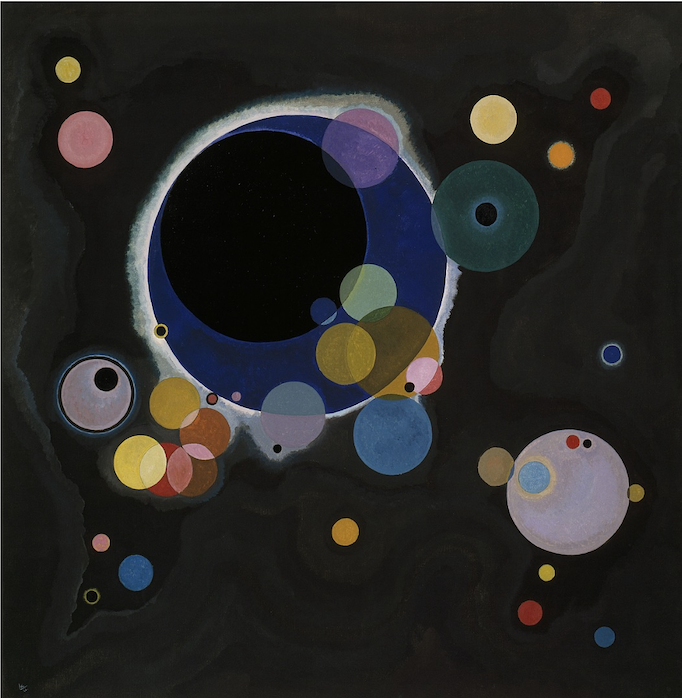
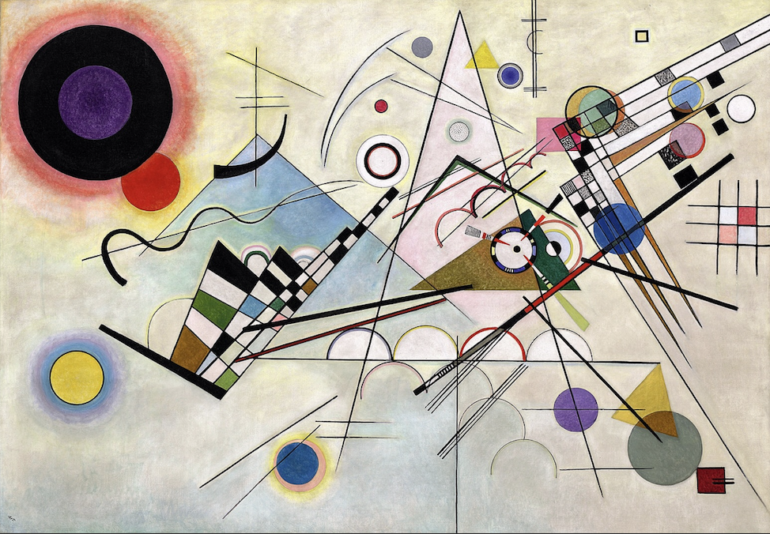
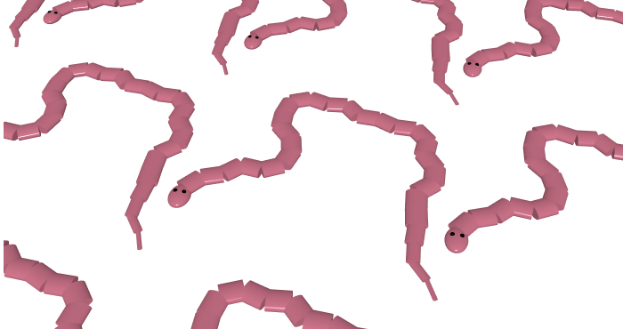

# Hsea0693_9103_03


>### 05/7/2026 **Quiz 8**
# Part 1: Imaging Technique Inspiration 

 For inspiration in imaging technique for our assignment, I found **Wassily Kandinsky’s** artwork fitting and unique. His geometric abstraction, seen in *Several Circles* and *Composition VIII*, stands out through:
- layered circles
- straight lines
- strong unique geometric forms

As a result they create rhythmic movement even though the piece is static. 

###### _(As show in Images below)_

### *Several Circles*



### *Compsition VIII*


In my assessment I want to incorporate the layering of circles, lines, and sharp geometric forms to build a **dynamic abstract composition.** This technique suits our assignment because Kandinsky’s **structured** yet **expressive** compositions can **translate effectively into code** while allowing creative reinterpretation through techniques we learnt like:
- Animation
- Interactivity
- Audio reactivity 
- User-input mechanics

Overall, his artwork provides a strong balance between artistic expression and computational design. </p>


# Part 2: Coding Technique Exploration
### Coding Technique: buildGeometry():Custom 3D Geometry

 The function that I found that works well with Kandinsky's work is the **buildGeometry()** function in p5.js, which stores shapes into a 3D model that can be efficiently used and reused. 

 ###### _(As show in Images below)_
 ### *BuildGeometry example by Dave Pagurek*
 
 
 This technique supports the layered style and rhythmic quality that Kandinsky's work creates, as shown in *Composition VIII* , by enabling multiple instances of a custom geometric form 
to be tiled and rotated in 3D space. Using transformation and rotation functions, shapes can be built with precise spatial control, each element isolated and intentional, mirroring Kandinsky's *structured* yet **expressive** compositions. The additional *colorMode(HSB)* makes it so that we can change colours through **hue and brightness**, echoing the **bold palette** of both *Several Circles* and *Composition VIII*,making it a strong foundation for creative reinterpretation through:
- Animation
- Interactivity 

### Links to Code

[p5.js Custom Geometry](https://p5js.org/examples/3d-custom-geometry/)


### Example Code
```javascript
snake = buildGeometry(() => {
  colorMode(HSB, 100);
  fill(random(100), 50, 100);
  push();
  scale(1, 0.5, 1.4);
  sphere(50);
  pop();
});
` ` `


